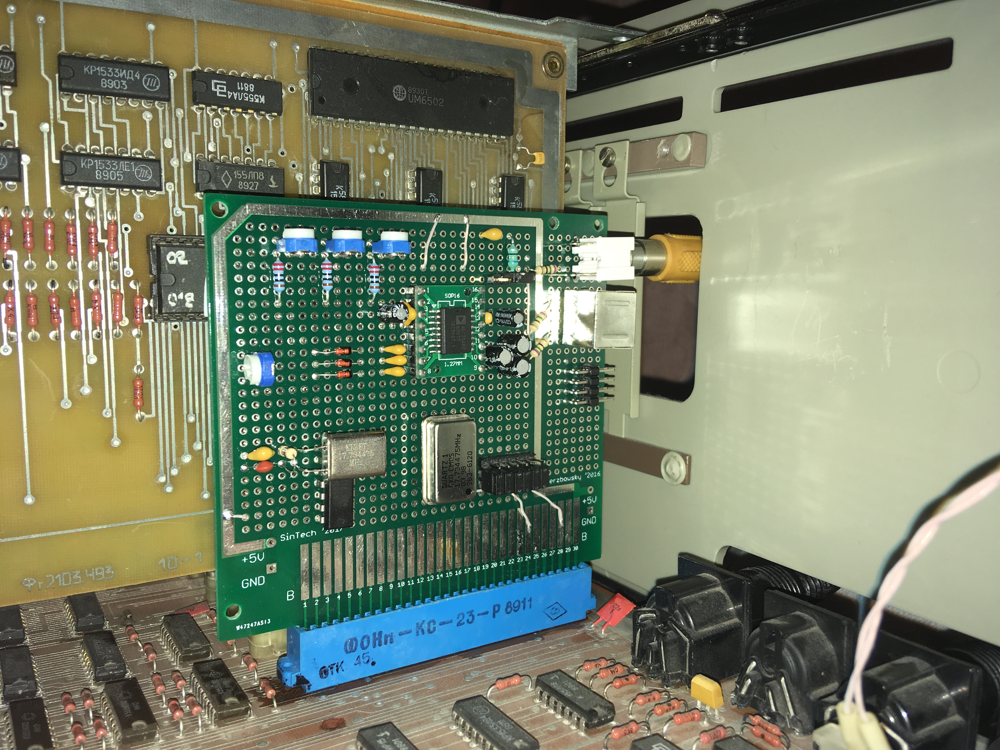

# Agat PAL Coder #

Реализация платы преобразователя RGB -> Composite + S-Video стандарта PAL на базе микросхемы [AD725](https://www.analog.com/media/en/technical-documentation/data-sheets/AD725.pdf "AD725").

Схема обвязки AD725 почти полностью скопирована из Datasheet. При сборке устройства,  особое внимание стоит уделять блоку генерирования опорной частоты. С некоторыми кварцевыми генераторами не удавалось добиться стабильной работы, с вариантом генератора на кварцевом резонаторе и 74HC04 пришлось подбирать номиналы нагрузочных конденсаторов.

Плата поддерживает два варианта подачи входного сигнала: с внешнего входа, коммутируемого с RGB-выходом Агат или напрямую от шины Агат-7. На разъем X1 генплаты Агат-7 выведены все достаточные для работы преобразователя сигналы: R, G, B, Y, HSYNC, VSYNC. Переключение между входами осуществляется джамперами на плате.
> В других слотах Агат-7 и на генплате Агат-9 данные сигналы отсутствуют.

Настройка платы заключается в установке уровней сигналов RGB в диапазоне 0-714 mV на входах RIN, GIN, BIN с помощью подстроечных резисторов RV2-4. А также желаемого уровня яркости цветов с активным битом Y с помощью RV1.

