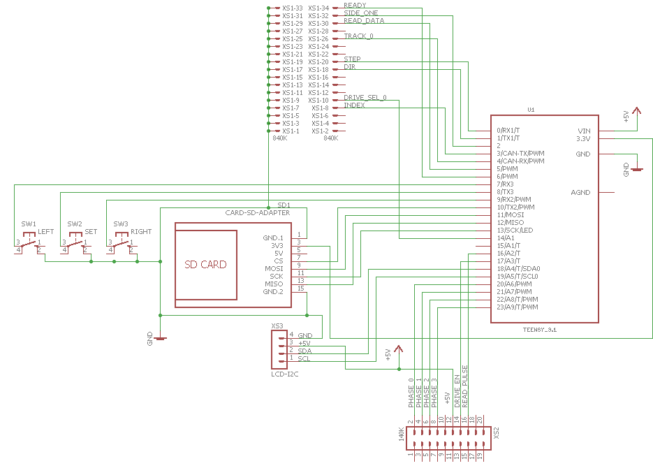

# Эмулятор дисковода для ПЭВМ Агат

Целью данного проекта было создание устройства для загрузки образов дискет, доступных  в интернет, на реальном Агат-7, а также изучение формата дискет 840кб, специфичного для Агат.
Достоинством данного проекта является возможность одновременной эмуляции обоих дисководов Агат (140 и 840К). Кроме того, не требуется предварительная обработка образов на компьютере, в отличие от эмуляторов на основе HxC и его клонов.  

## Технические характеристики
- Дисковод 140кб:
 - форматы: DSK, NIC (raw CGR), в планах: NIB
- Дисковод 840кб:
 - форматы: DSK, AIM, NIM (сырые MFM данные), в планах: NIB
 - эмулируемые сигналы: Ready, Track0, Index.
- На данный момент работает только чтение, поддержка записи - в планах.
- Питание: +5В.
- Хранилище образов: SD карта.
- Интерфейс управления: кнопки влево, вправо, выбор/применить. 
- Экран: 2 строки по 16 символов.

## Описание работы
Эмулятор состоит из нескольких, частично независимых модулей: эмулятора дисковода 140К (совместимого с Apple II), эмулятора Агат 840К и общего модуля управления.
В каждый отдельный момент времени активным может быть только один из виртуальных дисководов.

После подачи питания устройство считывает из EEPROM информацию о последних активных образах и загружает в память их первые дорожки. На экране отображается имя текущего образа для каждой модели дисковода. Первая строка - 140К, вторая - 840К.

При изменении уровней сигналов "DRIVE ENABLE" в приходящих от контроллеров шлейфах происходит активация соответствующего виртуального привода, и на выход "READ PULSE" начинают поступать данные из образа. Передача данных активной дорожки производится циклически, при этом для формата Агат 840К корректно формируются сигналы начала и конца индексного отверстия, а также сигнал TRACK0, если текущая дорожка - нулевая. Если в процессе передачи происходит перемещение головки дисковода, то цикл прерывается.

> Для формата Агат 840К при смене стороны дискеты прерывания цикла не происходит, т.к. в памяти находятся обе ее стороны.
 
Эмулятор постоянно отслеживает изменение уровней сигналов на входах? отвечающих за положение головки дисковода. Это входы STEP, DIRECTION и SIDE для 840К дисковода и PHASE_0-PHASE_3 - для дисковода 140К. Соответственно изменяется номер текущей дорожки.

В начале каждого цикла производится проверка положения считывающей головки обоих дисководов. Если оно изменилось, то происходит загрузка соответствующего трека из выбранного образа, преобразование в соответствии со спецификацией, кодирование в MFM или GCR (если это необходимо) и возврат в режим передачи данных. На экране всегда отображается номер текущей дорожки и метка активного дисковода ">".
</img>

Если в процессе передачи была нажата кнопка "выбор", эмулятор переходит в режим выбора образа. На экране отображается приглашение выбрать образ, а также тип образа (140/840), на котором стоит курсор. 
</img> </img>
После выбора нового файла кнопками "вправо", "влево" и нажатия "применить" эмулятор производит загрузку трека из файла в соответствующий виртуальный дисковод и возвращается в режим передачи.

Эмулятор поддерживает работу в паре с реальным дисководом каждого типа, для этого в неактивном состоянии он переводит свои выходы в высокоомный режим.

## Схема
Эмулятор проектировался исходя из соображений простоты повторения и минимума деталей.
Разъемы на схеме: 
- XS1 - для подключения к контроллеру 840K, распайка под розетку 34 контакта. 
- XS2 - к контроллеру 140К. Распайка под разъем контроллера Apple Disk II.

Питание (+5В) может поступать от любого контроллера или от обоих сразу.

Список деталей:

1. Плата [Teensy 3.1](https://www.pjrc.com/teensy/teensy31.html) (32-bit ARM Cortex-M4 72 MHz) - 1 шт.
2. Экран 16х2 с I2C интерфейсом - 1 шт.
3. Кнопка тактовая - 3 шт.
4. Держатель SD карты - 1 шт.

## Программное обеспечение
ПО эмулятора разработано в среде Arduino IDE и использует несколько сторонних библиотек:
- SdFat - https://github.com/greiman/SdFat
- new-liquidcrystal - https://bitbucket.org/fmalpartida/new-liquidcrystal/wiki/Home
- dwt_timer.h - https://gist.github.com/RickKimball/8bc8228cfb6f73ccf2e9

Программа состоит из трех основных частей:
- инициализация ввода/вывода, чтение каталога файлов с SD карты;
- основной рабочий цикл, описанный выше;
- функции: чтения и преобразования образов дискет, кодирования в низкоуровневый формат и  формирования потока импульсов.

Если с первыми двумя пунктами все более или менее понятно, то на последнем остановимся подробнее.
На данный момент реализована поддержка следующих видов образов:
### Формат 840K
####DSK
Размер файла на диске: 860160 байт. Может незначительно отличаться в зависимости от наличия заголовка или эпилога. 
В образе хранится только информация из поля данных без дополнительных сведений о номере дорожки и сектора. Дорожки расположены последовательно с 0 по 159. 
После загрузки каждой дорожки выполняется ее преобразование в соответствии с форматом [1], добавляются служебные интервалы, заполняются поля адреса и данных, рассчитывается контрольная сумма. Полученный результат кодируется в MFM и сохраняется в кеш. Эмулятор кеширует в памяти две последовательные дорожки с четным и нечетным номером. Это сделано для простоты переключения между верхней и нижней стороной дискеты, т.к. четные дорожки записаны на одной стороне, а нечетные - на другой.

#### AIM
Размер файла на диске: 2068480 байт. 
После загрузки из образа нулевой дорожки выполняется обработка данных в соответствии с форматом AIM. В нужные места вставляются синхросбои, запоминается позиция начала и конца импульса индексного отверстия, сохраняется позиция заворота дорожки на начало.
На данный момент никакой дополнительной модификации содержимого дорожки не производится. Далее производится кодирования в MFM и сохранение в кеш. При выдаче информации учитываются сохранённые позиции индексного отверстия, и если необходимо, производится заворот дорожки на начало.  

#### NIM
Размер файла на диске: 2000000 байт.
Данный формат был придуман для отладки эмулятора и представляет собой сырой поток MFM  данных, который не требует дополнительной обработки, его достаточно выдать на выход READ. Для конвертирования в этот формат была создана утилита на PHP. 

### Формат 140K (Apple II совместимый)
#### DSK
Размер файла на диске: 143360 байт.
Аналогично формату DSK 840K, только с поправкой на меньшее количество дорожек и секторов. Используется только одна сторона дискеты. К данным, в соответствии с форматом Apple, добавляются служебные промежутки, поле адреса, рассчитывается контрольная сумма, выполняется кодирование в GCR. Секторы выстраиваются, учитывая порядок interleave. 

#### NIC
Размер файла на диске: 286720 байт.
Формат был использован Koichi Nishida в проекте [SDISK II][2]. Представляет собой сырые данные, готовые для передачи без дополнительного преобразования.

## Литература
1. Описание формата Агат 840к - [agat-840k-format.txt](agat-840k-format.txt)
2. Jim Sather. Understanding the Apple II, 1983.
3. Don Worth, Pieter Lechner. Beneath Apple DOS 5h edition, 1983.
4. Документация по контроллеру 840К на сайте agatcomp.ru

## Благодарности
- Koichi Nishida - за его проект [SDISK II][2], натолкнувший меня на идею создания своей версии эмулятора дисковода.
- Oleksandr Kapitanenko - за утилиты преобразование в формат HxC и описание формата DSK и AIM 840K.
- Сайту [agatcomp.ru](agatcomp.ru) - за самое большое хранилище информации об Агатах и тысячи сохранившихся программ. Отдельное спасибо Игорю и Владимиру.

[2]: http://tulip-house.ddo.jp/digital/SDISK2/english.html

При работе над этим проектом были применены знания и исходный код, полученные в процессе  создания эмулятора дисковода Apple Disk II.